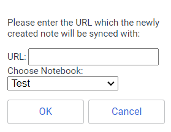
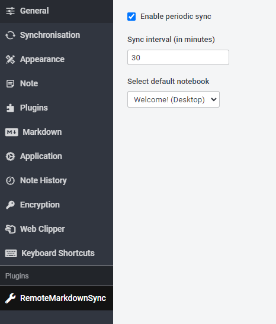

# Joplin Plugin Remote Note Pull

  

This [Joplin](https://github.com/laurent22/joplin) plugin allows websites to be saved as notes and updated periodically based on the original website URL.

This way you can always work with the latest version of online cheat sheets/websites and docs in your favourite notebook without manually update it by yourself.

## Install
**Official:**
Joplin has a [community plugin store](https://joplinapp.org/plugins/plugin/github.hegerdes.joplin_remote_note_pull/) with an integrated browser for plugin. This plugin is now also released there. Just search for `remote-note-pull`.

**Manual:**
You can get the latest version like this:
 * Download the latest release from [GitHub Releases](https://github.com/hegerdes/joplin-plugin-remote-note-pull/releases) or [NpmJs](https://www.npmjs.com/package/joplin-plugin-remote-note-pull)
 * Extract the archive
 * Open Joplin and open the Settings via the Tools/Options menu
 * Go to Plugins
 * Click *Manage Plugins* and browse to the downloaded release and chose the `.jpl` file

## Getting Started
After Install you can go to the *Tools* menu. There will be a new option *Create new SyncNote*.

Enter a URL and wait some second. The newly created note will be periodically updated with the URL you entered. The default interval is 30m.
**NOTE:** Every manual change in the note will be overwritten!

You can change the default interval via the Joplin settings. A new option group will be added on plugin install. It allows you to enable the sync feature, sets the sync interval and the default target notebook.
With the *DownArrow* Icon in the top right you can also trigger a manual update on any currently selected sync-note.

## Contribute
If you have any feature requests or found a bug feel free to open a [GitHub Issue](https://github.com/hegerdes/joplin-plugin-remote-note-pull/issues/new/choose) or even provide a pull-request.

## Development
Make sure you have nodeJS >= 16 installed

Clone the repo and open it in your favourite editor. The most important files are:

- `/src/index.ts`, which contains the entry point for the plugin source code.
- `/src/manifest.json`, which is the plugin manifest. It contains information such as the plugin a name, version, etc.

See here for information about publishing [Joplin Forum](https://discourse.joplinapp.org/t/plugins-multiple-questions-sharing-publishing-etc/30551)
For more information see [here](https://github.com/laurent22/joplin/tree/dev/packages/generator-joplin#publishing-the-plugin)

## Building the plugin

The plugin is built using Webpack, which creates a compiled bundle in `/dist`. A JPL archive will also be created at the root, which can use to distribute the plugin.

To build the plugin, simply run `npm run dist`.

The project is setup to use TypeScript, although you can change the configuration to use plain JavaScript.

You can also use `npm run dev` to build the plugin and open Joplin in dev mode.
